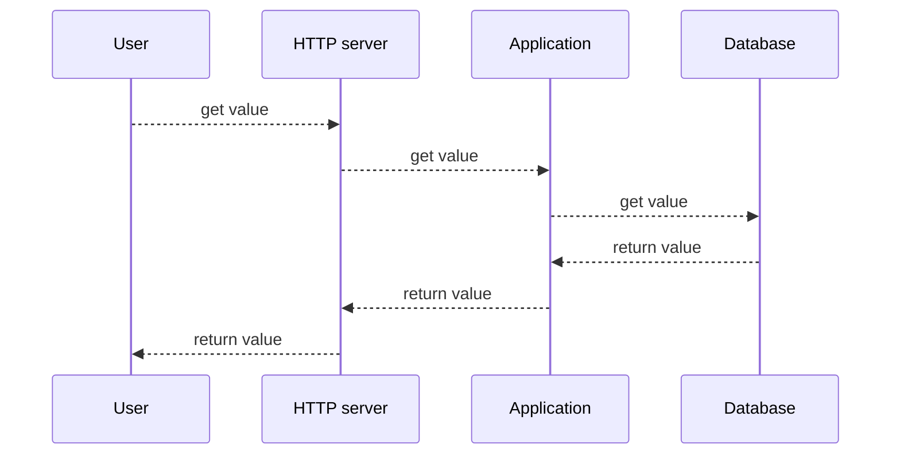

# Assumptions
Architecture design starts with requirement analysis. Here I make some assumptions about the requirements, which act as a starting point and should be revisited iteratively.

- The website will keep being simple, fit into a nano service.

- High Availability is the key metric

- Maintainability is of great importance.

# Why is your solution so simple?
Yes, this solution is very simple.

And this is by design. Simplicity could be translated directly into low psychological burden for application developers and low cost of maintenance for platform/DevOps engineers.

- We don't have to manage region/network/VPC/SG, all of which are taken care of by CloudFlare.
- we don't have to provision/upgrade/patch/decommission virtual machines. CloudFlare invokes workers on the nodes near the clients where requests arrive.
- Cloudflare also takes care of sub-domains and certificates, in sharp contrast to AWS where you have to learn [a dedicated service to certificates](https://aws.amazon.com/certificate-manager/) and [a dedicated service to domains](https://aws.amazon.com/route53/), usually after you are hit by an catastrophic incident.
- There are not many v1alpha1 APIs which break every time you upgrade, as with Kubernetes. CloudFlare promises [Back Compatibility](https://blog.cloudflare.com/backwards-compatibility-in-cloudflare-workers/).
- CI/CD is easy. To release a new version, all you need to do is to merge a PR into [main branch](https://github.com/lipingtababa/trdl). [Github Actions](./.github/workflows/service.yml) and [CloudFlare Wrangler](https://developers.cloudflare.com/workers/wrangler/commands/#deploy) will ensure the system is upgraded safely.

# Implementation 
## CloudFlare provides Worker as the main runtime
Besides the reasons aforementioned, CloudFlare is affordable. Running a CDN distribution, an ALB, a TLS certificate, a Kubernetes cluster, a simple service,  an ElasticCache on AWS for 1 week probably costs me 30 USD, while running it on CloudFlare Worker costs basically nothing.

Availability provided by CloudFlare is natuarally 

## Github Actions provides the pipeline as a service
GitHub Actions is flexible enough to support various workflows, but not too flexible to confuse developers. It also pays great attention to security. Last but not least, it is a managed service, so maintenance is offloaded.

## CloudFlare provides built-in Observability
Given that our business logic is super simple, the http status codes provided by CloudFlare out of box can tell the whole story, mitigating the necessity of advanced observability tools.

Also given the simplicity, log collection will not enhance value but will incur substantial costs. Hence, it is not undertaken.

## Identify and Mitigate Risks to Availability
Considering the simplicity, risks to availability are very likely come from the network in stead of internal bugs, in forms of network failures or DDoS attacks.

To mitigate these risks, we have to be able to deploy applications globally, which in turn requires a CDN.

In fact, CloudFlare has such high confidence in their availability that they commit to [a SLA](https://www.cloudflare.com/en-gb/business-sla/) that, while strategically viable within a business context, is technically impossible.

`The Service will serve Customer Content 100% of the time without qualification.`

# How can I deploy it ?

As an application developer, one can always use "yarn dev" to start a local simulator and use "yarn test" to run unit test suite. 

However, it is strongly advised NOT to copy the code and deploy it manually. A good practice is that all the deployments are managed by [GitHub Actions workflows](./.github/workflows/service.yml), which acts as the source of truth in term of deployments.

In case one really needs to copy the code and deploy it somewhere else, he/she should update: 
- [CLOUDFLARE_API_TOKEN](./.github/workflows/service.yml#24) and [CLOUDFLARE_ACCOUNT_ID](./.github/workflows/service.yml#25).
- The KV namespaces specified in [wrangler toml](./wrangler.toml#8)

# TODO
## Test
- ~~Add E2E test suite~~.[Done](./test/e2e.test.ts)

## Cost Optimization
- Use a static site to serve the fixed 42 response.

## Extension of Functionalities
- ~~Implement the `/api` endpoint~~. [Done](./src/index.ts#13)
- ~~Implement the POST method.~~ [Done](./src/index.ts#13)
- Add authentication and authorization.